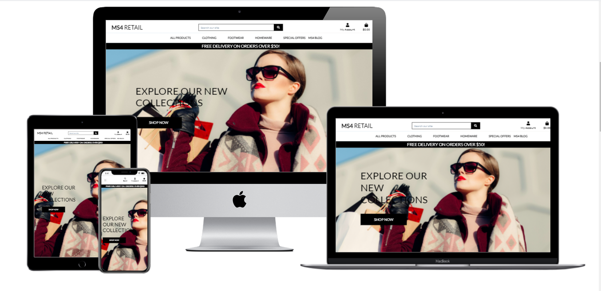
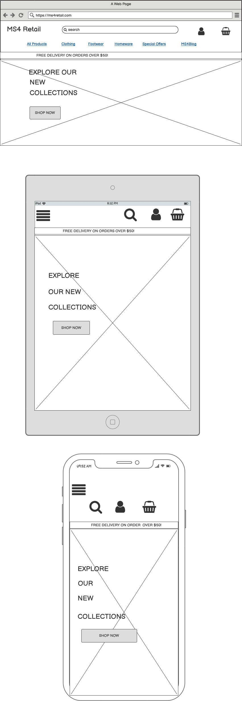
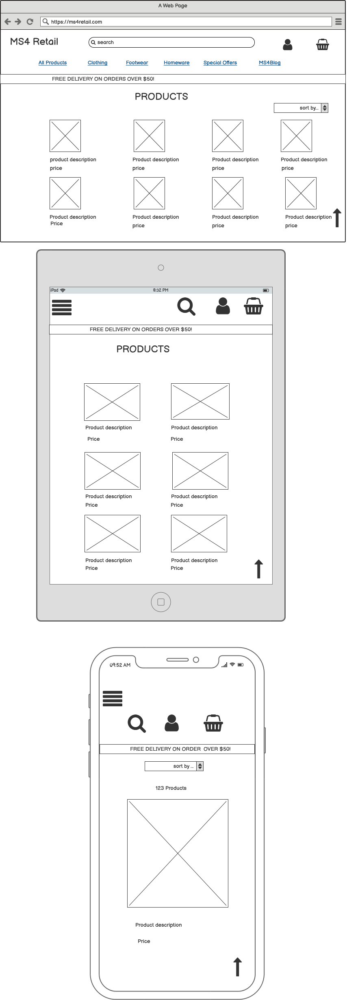
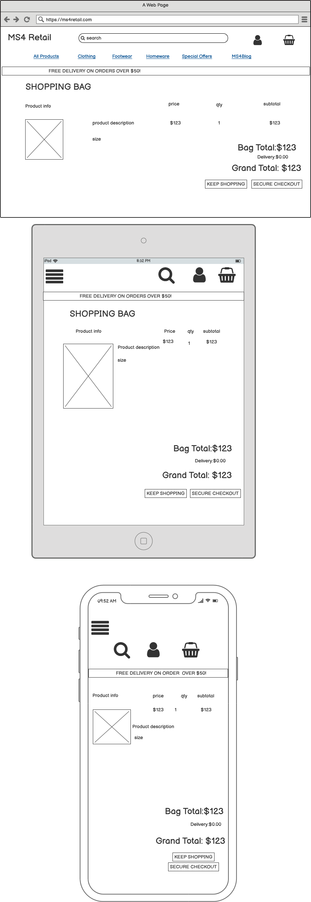
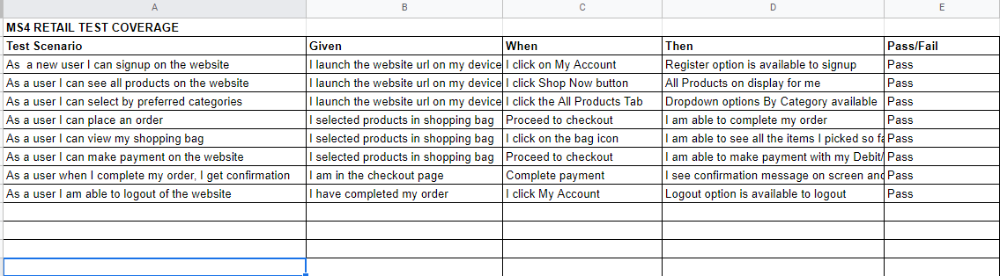

## Table of Contents
* [Purpose](#Purpose)
* [User Experience Design (UX)](#User-Experience-Design)
  * [User stories](#User-Stories)
    * [First Time Visitor Goals](#First-Time-Visitor-Goals)
    * [Returning Visitor Goals](#Returning-Visitor-Goals)
    * [Frequent User Goals](#Frequent-User-Goals)
  * [Structure](#Structure)
  * [Design](#Design)
    * [Colour Scheme](#Colour-Scheme)
    * [Typography](#Typography)
    * [Imagery](#Imagery)
    * [Wireframes](#Wireframes)
    * [Differences to Design](Differences-to-Design)
* [Limitations](#Limitations)
- [Features](#Features)
    * [Existing Features](#Existing-Features)
    * [Future Features](#Features-Left-to-Implement)
* [Technologies](#Technologies)
* [Testing](#Testing)
    * [Test Strategy](#Test-Strategy)
      * [Summary](#Summary)
      * [High Level Test Cases](#High-Level-Test-Cases)
      * [Out of Scope](#Out-of-Scope)
    * [Test Results](#Test-Results)
    * [Testing Issues](#Issues-and-Resolutions-to-issues-found-during-testing)
* [Deployment](#Deployment)
    * [Project Creation](#Project-Creation)
    * [Project Deployment](#Using-Heroku)
    * [Locally](Run-Locally)
* [Credits](#Credits)
  * [Content](#Content)
  * [Media](#Media)
  * [Acknowledgements](#Acknowledgements)
  * [Comments](#Comments)

# Milestone Project 4
## Purpose
This E-Commerce Platform was created for the sole purpose of completing the fourth Milestone Project for the Code Institute's Full Stack Developer course. 
It was built using the knowledge gained from the HTML, CSS, Javascript, Python+Django and Full Stack Frameworks with Django modules. A full list of technologies used can be found in the technologies section of this document.

The live website can be found [here](https://ms4-retail.herokuapp.com/).

## MS4 Retail Responsive Website

The MS4 Retail E-Commerce Platform was built as to bring ease and comfort to customer online shopping experience, as they can buy anytime anywhere and have their orders delivered.

*** 
## User Experience Design

### User stories
#### First Time Visitor Goals
* As a First Time user, I want to easily understand the essence of the site and learn more about the offerings.
* As a First Time user, I want to be able to easily navigate throughout the site to find products.
* As a First Time user, I want to view the website and content clearly on my mobile device.
* As a First Time user, I want to be able to buy products offered on the website.
#### Returning Visitor Goals
* As a Returning user, I want to be able to see my order history.
* As a Returning user, I want to be able to make further purchases.
* As a Returning user, I want to be able to see latest offerings on the website.
#### Frequent Visitor Goals
* As a Frequent user, I want to check to see if there are new collections of products on offer.
* As a Frequent user, I want to check to see if there are new blogposts to learn more about the business offerings.
### Structure
All Pages will contain a Navigation menu at the top of the Webpage that directs them to a new Page to easily allow users to Navigate the site easily.
The Nav Menu will be collapsable on a Mobile device to make use of space on smaller devices.
The purpose of this is to fulfill user story:
> As a First Time user, I want to be able to easily navigate throughout the site to find products.

The Home Page will a cover hero image of a shopper, this explains the website is a shopping website.
The purpose of this is to fulfill user story:
> As a First Time user, I want to easily understand the essence of the site and learn more about the offerings.

Custom CSS and/or Bootstrap will be used to make the Website responsive by the use of media queries and/or the Boostrap Grid system.

All pages will be responsive and the layouts will change dependant on screen size. This is to ensure content flow is appealing,
images are displayed properly and that the content is not shrunk side by side, so small that it is unreadable.
The purpose of this is to fulfill user story:
> As a First Time user, I want to view the website and content clearly on my mobile device.

### Design
#### Colour Scheme
The two main colours used are White  and Black to keep the layout simple and allow the products images add more colours
#### Typography
Lato font is used throughout the project.
#### Imagery
Product photographs are taken from Kaggle.com. Online data set resource.
#### Wireframes
Home Page 
 
Main Page 
 
Checkout Page 
 

For full side PDF's of the wireframes, please click the links below
* [Home Page Wireframe](media/wireframes/Home.pdf)

* [Main Page Wireframe](media/wireframes/Main_Page.pdf)

* [Checkout Page Wireframe](media/wireframes/Checkout_Page.pdf)

***
## Features
 
### Existing Features
- User login feature
- User Order management
- User order checkout
- User Payment enabled by Stripe
- User authentication

### Features Left to Implement
- Add Blog content from front-end
- Allow site users to engage via comment sections in blog post.
***
## Technologies

* HTML
	* This project uses HTML as the main language used to complete the structure of the Website.
* CSS
	* This project uses custom written CSS to style the Website.
* Javascript
    * This project uses javascript to enhance the dynamism and responsiveness of the website
* Python+Django
    * This project is built on Python-Django Frameworks Fullstack
* Postgresql
    * This project uses postgresql as database
* Stripe
    * Payment Processing Platform as order payment processor
* [Bootstrap](https://getbootstrap.com/)
	* The Bootstrap framework is used throughout this website for layouts and styling. The car
	* This has also been used to import JavaScript/Query used for the pop up Event booking modal
* [Font Awesome](https://fontawesome.com/)
	* Font awesome Icons are used for the Social media links contained in the Footer section of the website.
* [Google Fonts](https://fonts.google.com/)
	* Google fonts are used throughout the project to import the *Libre Baskerville* and *Cabin* fonts.
* [Gitpod](https://gitpod.io/)
	* Gitpod is the Integrated Development Environment used to develop the Website.
* [GitHub](https://github.com/)
	* GithHub is the hosting site used to store the source code for the Website and [Git Pages](https://pages.github.com/) is used for the deployment of the live site.
* [Git](https://git-scm.com/)
	* Git is used as version control software to commit and push code to the GitHub repository where the source code is stored.
* [TinyJPG](https://tinyjpg.com/)
	* TinyJPG is used to reduce the file sizes of images before being deployed to reduce storage and bandwith.
* [Google Chrome Developer Tools](https://developers.google.com/web/tools/chrome-devtools)
	* Google chromes built in developer tools are used to inspect page elements and help debug issues with the site layout and test different CSS styles.
* [balsamiq Wireframes](https://balsamiq.com/wireframes/)
	* This was used to create wireframes for 'The Skeleton Plane' stage of UX design.
* [Techsini](http://techsini.com/multi-mockup/index.php)
    * tecnisih.com Multi Device Website Mockup Generator was used to create the Mock up image in this README

***
## Testing

### Test Strategy 

#### Summary 

Testing is required on MilestoneProject-4 – MS4 Retail E-Commerce Website to ensure all features are working correctly to serve the end users well as intended.

All Features were tested on different screen sizes and devices and all to testers satisfactions.

The live Project can be found [here](https://ms4-retail.herokuapp.com/). 
#### High Level Test Cases 

 

### Test Results
All Pages were run through the [W3C HTML Validator](https://validator.w3.org/) and showed no errors. 
CSS Stylesheet was run through the [W3C CSS Validator](https://jigsaw.w3.org/css-validator/validator) and showed no errors. 
All Python codes were run through the [Pep8online checker](http://pep8online.com/) and satisifies PEP8 compliance.
Website was tested by running locally and tested on the deployed version. No differences found.

### Issues and Resolutions to issues found during testing
* Database migration to Postgresql failed due to update SQAlchemy in the CI Github template I used.
* Igor_Ci on Slack helped out with the code 'unset PGHOSTADDR'
* 
* Project failed to run locally after I deleted some media files from database
* I cleared cache and restarted workspace.
* 
* 

## Deployment

### Project Creation
The project was started by navigating to the [template](https://github.com/Code-Institute-Org/gitpod-full-template) and clicking 'Use this template'. Under Repository name I input MS4 and checked the Include all branches checkbox. I then navigated to the new [repository](https://github.com/OluwafemiAwosanya/MS4) and clicked the Gitpod extension button on my Github to open the Gitpod editor.

The following commands were used throughout the project:

* git add filename - This command was used to add files to the staging area before commiting.
* git commit -m "commit message explaining the updates" - This command was used to to commit changes to the local repository.
* git push - This command is used to push all commited changes to the GitHub repository. 

### Project Deployment
The Project was deployed for hosting on [Heroku](https://heroku.com) with the following steps;

1. I created Heroku App for the project 
2. Connected Git Remote
3. Added required packages to requirements.txt
4. Freeze requirements.txt
5. Added Procfile with Capital 'P'
6. Deployed code to Heroku
7. Enable Automatic Deploy in Heroku

Static files, mainly media files are hosted on [Amazon Web Services](https://aws.amazon.com)

### Run Locally
1. Navigate to the GitHub [Repository:](https://github.com/OluwafemiAwosanya/MS4)
2. Click the Code drop down menu.
3. Either Download the ZIP file, unpackage locally and open with IDE (This route ends here) OR Copy Git   URL from the HTTPS dialogue box.
4. Open your developement editor of choice and open a terminal window in a directory of your choice.
5. Use the 'git clone' command in terminal followed by the copied git URL.
6. A clone of the project will be created locally on your machine.

***
## Credits
### Code

### Content
The content of this software was created by Oluwafemi Awosanya with guidance from the Code Institute video lectures, Youtube videos and My Mentor Spencer Barriball

### Media
The Homepage background image was taken from [Unsplash Photos for everyone](https://unsplash.com/)
All the products images and properties are taken from [kaggle.com](https://www.kaggle.com/vikashrajluhaniwal/fashion-images)

### Acknowledgements

I'd like to thank my mentor Spencer Barriball for his guidance throughout my project. 
Thanks to YouTube pages like Traversy Media, Techworld with Nana and Codemy, their resources has been of immense help. 
I'd like to give a special mention to all Code Institute Tutors and the Code Institute Slack Community for a great learning experience in the last 12 months. 
